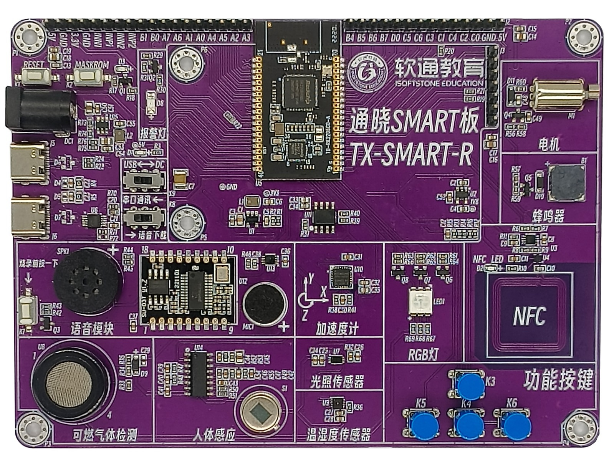

## docs 资料包目录结构

| 目录名    | 描述                                                         |
| --------- | ------------------------------------------------------------ |
| board     | [通晓开发板原理图](./vendor/isoftstone/rk2206/docs/board/通晓开发板原理图_06_21.pdf) |
| datasheet | [数据手册](./vendor/isoftstone/rk2206/docs/datasheet)        |
| figures   | 资料图库                                                     |

## 资料导航

| No   | 类别           | 路径                                                         |
| ---- | -------------- | ------------------------------------------------------------ |
| 1    | 开发板硬件资料 | [硬件原理图](./vendor/isoftstone/rk2206/docs/board/通晓开发板原理图_06_21.pdf) |
| 2    | 环境搭建       | [教程](./vendor/isoftstone/rk2206/README_zh.md)              |
| 3    | 案例代码列表   | [案例](./vendor/isoftstone/rk2206/samples/README_zh.md)      |

## 一、通晓开发板介绍

* 主控为瑞芯微RK2206芯片，200MHz主频，RAM 256KB、ROM 16KB、PSRAM 8M、FLASH 8M。
* 板载NFC Forum Type 2 Tag芯片及天线，可实现HarmonyOS“碰一碰”功能。
* 支持 IEEE 802.11b/g/n 制式，AP 模式。
* USB 2.0 、SD card /SPI/I2C 接口、E53 接口（包含 UART、 I2C、ADC、DAC、PWM、5 个 GPIO）。
* 一根TypeC USB线，即可实现供电、下载等功能。
* 一根TypeC USB线，可支持串口调试功能。

## 二、快速上手（十分钟上手）

如果您想快速的体验一下HarmonyOS的源码 `[获取]`、`[编译]`、`[烧录]`过程，强烈建议您学习以下教程，这能让您在环境安装环节省下不少时间。

1、文档

* [编译环境搭建](./vendor/isoftstone/rk2206/README_zh.md)

## 三、通晓开发板 案例开发

通晓开发板提供多个案例，案例以A、B、C、D、E进行不同类别进行分级，方便初学者由浅入深逐步学习。您拿到工程后经过简单的编程和下载即可看到实验现象。下面依次对A/B/C/D/E类进行介绍：

* `A1 - A99`：内核类
* `B1 - B99`：基础外设类
* `C1 - C99`：基础设备类
* `D1 - D99`：综合实验类
* `E1 - E99`：物联网综合实验类

例程列表如下所示：

| 编号 | 类别           | 例程名               | 说明                                                         |
| ---- | -------------- | -------------------- | ------------------------------------------------------------ |
| A1   | 内核           | thread               | [任务](./vendor/isoftstone/rk2206/samples/a1_kernal_task/README_zh.md) |
| A2   | 内核           | semaphore            | [信号量](./vendor/isoftstone/rk2206/samples/a2_kernel_semaphore/README_zh.md) |
| A3   | 内核           | timer                | [定时器](./vendor/isoftstone/rk2206/samples/a3_kernel_timer/README_zh.md) |
| A4   | 内核           | mutex                | [互斥锁](./vendor/isoftstone/rk2206/samples/a4_kernel_mutex/README_zh.md) |
| A5   | 内核           | queue                | [消息队列](./vendor/isoftstone/rk2206/samples/a5_kernel_queue/README_zh.md) |
| A6   | 内核           | event                | [事件](./vendor/isoftstone/rk2206/samples/a6_kernel_event/README_zh.md) |
| A7   | 内核           | hal_file             | [标准文件读写](./vendor/isoftstone/rk2206/samples/a7_hal_file/README_zh.md) |
| A8   | 内核           | hal_dir              | [标准目录操作](./vendor/isoftstone/rk2206/samples/a8_hal_dir/README_zh.md) |
| B1   | 基础外设       | gpio                 | [GPIO实验](./vendor/isoftstone/rk2206/samples/b1_gpio/README_zh.md) |
| B2   | 基础外设       | gpio_interrupt       | [GPIO中断实验](./vendor/isoftstone/rk2206/samples/b2_gpio_interrupt/README_zh.md)             |
| B3   | 基础外设       | adc                  | [ADC实验](./vendor/isoftstone/rk2206/samples/b3_adc/README_zh.md)                             |
| B4   | 基础外设       | uart0                | [UART0实验](./vendor/isoftstone/rk2206/samples/b4_uart0/README_zh.md)                         |
| B5   | 基础外设       | uart2                | [UART2实验](./vendor/isoftstone/rk2206/samples/b5_uart2/README_zh.md)                         |
| B6   | 基础外设       | i2c_scan             | [I2C扫描实验](./vendor/isoftstone/rk2206/samples/b6_i2c_scan/README_zh.md)                    |
| B7   | 基础外设       | beep                 | [蜂鸣器实验](./vendor/isoftstone/rk2206/samples/b7_beep/README_zh.md)                         |
| B8   | 基础外设       | electrical_machinery | [电机实验](./vendor/isoftstone/rk2206/samples/b8_electrical_machinery/README_zh.md)           |
| B9   | 基础外设       | rgb_led              | [RGB灯实验](./vendor/isoftstone/rk2206/samples/b9_rgb_led/README_zh.md)                       |
| B10  | 基础外设       | wifi_udp             | [UDP实验](./vendor/isoftstone/rk2206/samples/b10_wifi_udp/README_zh.md)                       |
| B11  | 基础外设       | wifi_tcp             | [TCP实验](./vendor/isoftstone/rk2206/samples/b11_wifi_tcp/README_zh.md)                       |
| B12  | 基础外设       | watchdog             | [看门狗实验](./vendor/isoftstone/rk2206/samples/b12_watchdog/README_zh.md)                    |
| B13  | 基础外设       | reboot               | [复位实验](./vendor/isoftstone/rk2206/samples/b13_reboot/README_zh.md)                        |
| C1   | 基础设备       | gas_sensor           | [气体传感器实验](./vendor/isoftstone/rk2206/samples/c1_gas_sensor/README_zh.md)               |
| C2   | 基础设备       | lcd                  | [LCD实验](./vendor/isoftstone/rk2206/samples/c2_lcd/README_zh.md)                             |
| C3   | 基础设备       | eeprom               | [EEPROM实验](./vendor/isoftstone/rk2206/samples/c3_eeprom/README_zh.md)                       |
| C4   | 基础设备       | nfc                  | [NFC实验](./vendor/isoftstone/rk2206/samples/c4_nfc/README_zh.md)                             |
| C5   | 基础设备       | sht30                | [温湿度传感器实验](./vendor/isoftstone/rk2206/samples/c5_sht30/README_zh.md)                  |
| C6   | 基础设备       | bh1750               | [光照强度传感器实验](./vendor/isoftstone/rk2206/samples/c6_bh1750/README_zh.md)               |
| C7   | 基础设备       | mpu6050              | [加速度传感器实验](./vendor/isoftstone/rk2206/samples/c7_mpu6050/README_zh.md)                |
| D1   | 综合实验       | smart_home           | [智慧家居实验](./vendor/isoftstone/rk2206/samples/d1_smart_home/README_zh.md) |
| D2   | 综合实验       | smart_security       | [智慧安防实验](./vendor/isoftstone/rk2206/samples/d2_smart_security/README_zh.md) |
| E1   | 物联网综合实验 | iot_smart_home       | [基于通鸿IOT平台智慧家居实验](./vendor/isoftstone/rk2206/samples/e1_iot_smart_home/README_zh.md) |
| E2   | 物联网综合实验 | iot_smart_security   | [基于通鸿IOT平台智慧安防实验](./vendor/isoftstone/rk2206/samples/e2_iot_smart_security/README_zh.md) |

## 四、源码目录简介

通晓开发板的源码目录延续OpenHarmony官方目录结构，以下是源码目录的说明：

| 目录名       | 描述                                  |
| ------------ | ------------------------------------- |
| applications | 应用程序样例                          |
| base         | 基础软件服务子系统集&硬件服务子系统集 |
| build        | 组件化编译、构建和配置脚本            |
| domains      | 增强软件服务子系统集                  |
| drivers      | 驱动子系统                            |
| foundation   | 系统基础能力子系统集                  |
| kernel       | 内核子系统                            |
| prebuilts    | 编译器及工具链子系统                  |
| test         | 测试子系统                            |
| third_party  | 开源第三方组件                        |
| utils        | 常用的工具集                          |
| vendor       | 厂商提供的软件                        |
| build.py     | 编译脚本文件                          |

## 五、开发板图片预览

