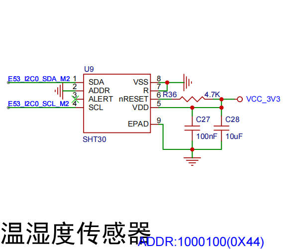
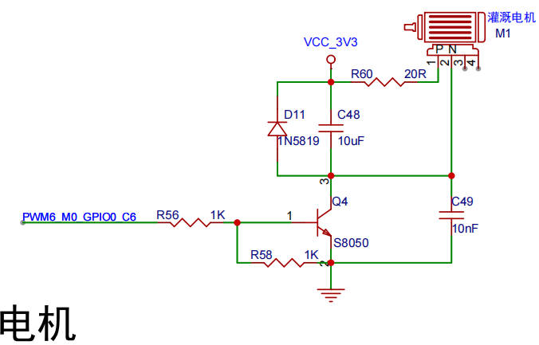
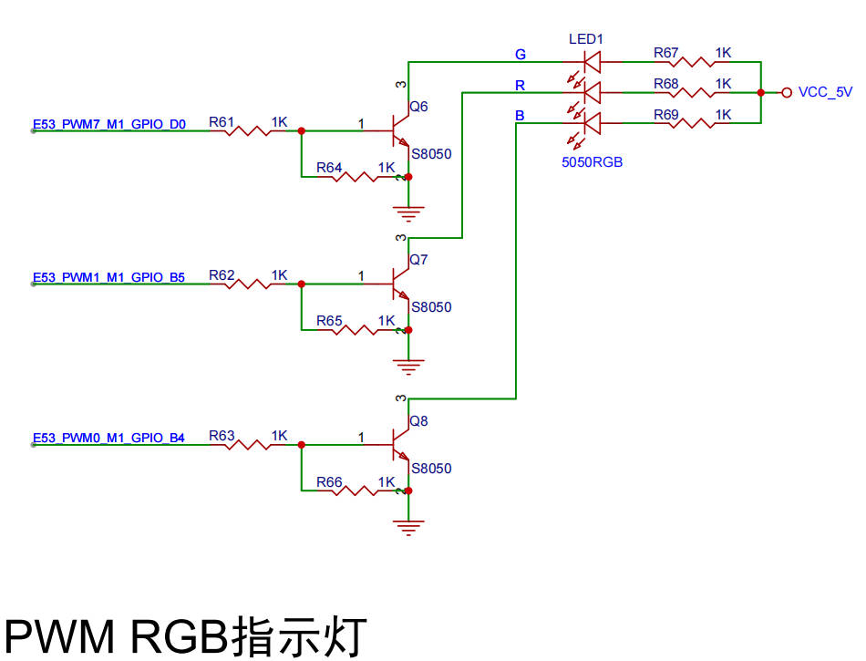
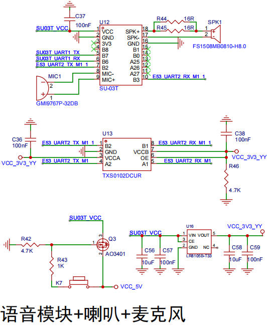
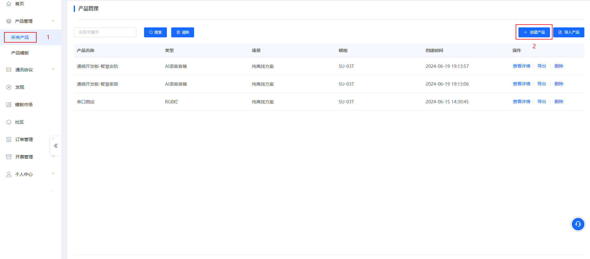
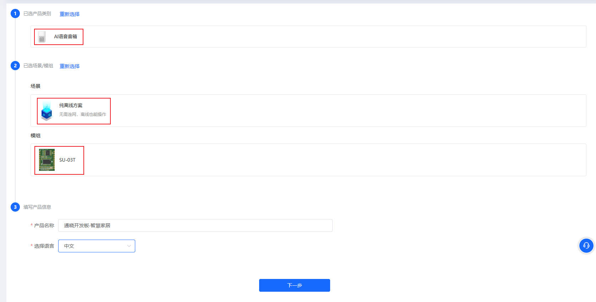
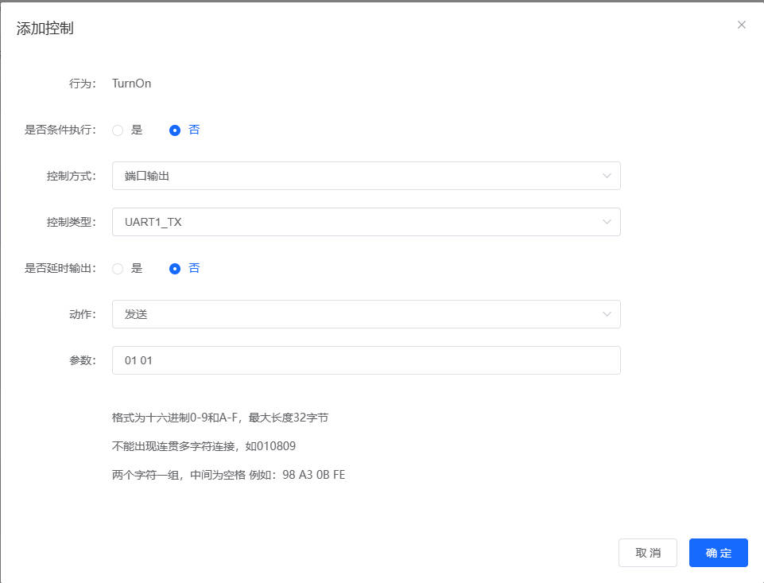
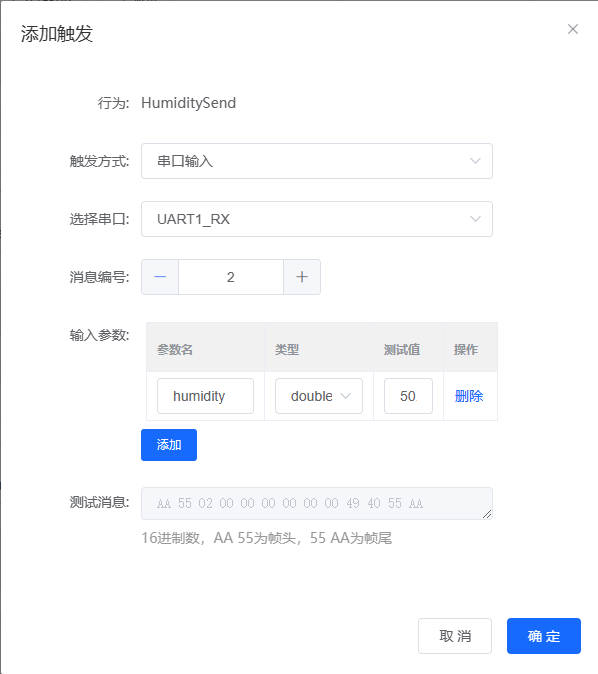

# 通晓开发板综合实验开发——智慧家居

本例程演示如何在通晓开发板上实现智慧家居应用案例。

## 实验设计

使用SHT30、BH1750传感器获取温度、湿度、光照强度，根据采集到的数据进行判断控制电机、RGB灯；LCD屏幕进行信息显示。语音模块获取数据进行播报和控制设备。

### 硬件设计











- sht30与bh1750共用I2C0(GPIO0_A1\GPIO0_A0)
- lcd屏幕使用SPI0
- 语音模块使用串口2(GPIO0_B2\GPIO0_B3)
- 电机使用PWM6(GPIO0_C6)
- rgb灯使用GPIO控制(GPIO0_PB5/GPIO0_PB4/GPIO1_PD0)

### 软件设计

#### 设备初始化

创建两个队列，用于传感器数据分别传输到不同的队列。创建了两个线程，一个用于读数据，一个用于显示与判断设备控制。

```c
    unsigned int thread_id_1;
    unsigned int thread_id_2;
    TSK_INIT_PARAM_S task_1 = {0};
    TSK_INIT_PARAM_S task_2 = {0};
    unsigned int ret = LOS_OK;

    ret = LOS_QueueCreate("queue", MSG_QUEUE_LENGTH, &m_msg_queue, 0, BUFFER_LEN);
    if (ret != LOS_OK)
    {
        printf("Falied to create Message Queue ret:0x%x\n", ret);
        return;
    }

    ret = LOS_QueueCreate("su03_queue", MSG_QUEUE_LENGTH, &m_su03_msg_queue, 0, BUFFER_LEN);
    if (ret != LOS_OK)
    {
        printf("Falied to create Message Queue ret:0x%x\n", ret);
        return;
    }

    task_1.pfnTaskEntry = (TSK_ENTRY_FUNC)smart_hone_thread;
    task_1.uwStackSize = 2048;
    task_1.pcName = "smart hone thread";
    task_1.usTaskPrio = 24;
    ret = LOS_TaskCreate(&thread_id_1, &task_1);
    if (ret != LOS_OK)
    {
        printf("Falied to create task ret:0x%x\n", ret);
        return;
    }

    task_2.pfnTaskEntry = (TSK_ENTRY_FUNC)device_read_thraed;
    task_2.uwStackSize = 2048;
    task_2.pcName = "device read thraed";
    task_2.usTaskPrio = 24;
    ret = LOS_TaskCreate(&thread_id_2, &task_2);
    if (ret != LOS_OK)
    {
        printf("Falied to create task ret:0x%x\n", ret);
        return;
    }
```

#### smart_hone_thread线程

在`smart_hone_thread`线程中初始化lcd、电机、led、语音模块设备。通过接收队列传输的数据进行判断显示。

```c
void smart_hone_thread(void *arg)
{
    double *data_ptr = NULL;

    double illumination_range = 50.0;
    double temperature_range = 35.0;
    double humidity_range = 80.0;

    lcd_dev_init();
    motor_dev_init();
    light_dev_init();
    su03t_init();

    lcd_load_ui();

    while (1)
    {
        LOS_QueueRead(m_msg_queue, (void *)&data_ptr, BUFFER_LEN, LOS_WAIT_FOREVER);

        if (data_ptr[0] < illumination_range && auto_state)
        {
            light_state = true;
            light_set_state(light_state);
        }
        else if (data_ptr[0] > illumination_range && auto_state)
        {
            light_state = false;
            light_set_state(light_state);
        }
        else if (!auto_state)
        {
            light_set_state(light_state);
        }

        if ((data_ptr[1] > temperature_range) && auto_state)
        {
            motor_state = true;
            motor_set_state(motor_state);
        }
        else if ((data_ptr[2] > humidity_range) && auto_state)
        {
            motor_state = true;
            motor_set_state(motor_state);
        }
        else if ((data_ptr[1] < temperature_range && data_ptr[2] < humidity_range) && auto_state)
        {
            motor_state = false;
            motor_set_state(motor_state);
        }
        else if (!auto_state)
        {
            motor_set_state(motor_state);
        }

        lcd_set_illumination(data_ptr[0]);
        lcd_set_temperature(data_ptr[1]);
        lcd_set_humidity(data_ptr[2]);
        lcd_set_light_state(light_state);
        lcd_set_motor_state(motor_state);
        lcd_set_auto_state(auto_state);

        printf("============= smart home example ==============\n");
        printf("======== data ========\r\n");
        printf("illumination:%5.2f\r\n", data_ptr[0]);
        printf("temperature:%5.2f\r\n", data_ptr[1]);
        printf("humidity:%5.2f\r\n", data_ptr[2]);
        printf("======== state ========\r\n");
        printf("light_state:%d\r\n", light_state);
        printf("motor_state:%d\r\n", motor_state);
        printf("auto_state:%d\r\n", auto_state);

        printf("\r\n");

        LOS_Msleep(500);
    }
}
```

在`su03t_init()`中，新开启了一个新线程`su_03t_thread`用于接收语音模块数据并作出响应的反应。

```c
static void su_03t_thread(void *arg)
{
    IotUartAttribute attr;
    double *data_ptr = NULL;
    unsigned int ret = 0;

    IoTUartDeinit(UART2_HANDLE);
    
    attr.baudRate = 115200;
    attr.dataBits = IOT_UART_DATA_BIT_8;
    attr.pad = IOT_FLOW_CTRL_NONE;
    attr.parity = IOT_UART_PARITY_NONE;
    attr.rxBlock = IOT_UART_BLOCK_STATE_NONE_BLOCK;
    attr.stopBits = IOT_UART_STOP_BIT_1;
    attr.txBlock = IOT_UART_BLOCK_STATE_NONE_BLOCK;
    
    ret = IoTUartInit(UART2_HANDLE, &attr);
    if (ret != IOT_SUCCESS)
    {
        printf("%s, %d: IoTUartInit(%d) failed!\n", __FILE__, __LINE__, ret);
        return;
    }

    while(1)
    {
        uint8_t data[64] = {0};
        uint8_t rec_len = IoTUartRead(UART2_HANDLE, data, sizeof(data));

        LOS_QueueRead(m_su03_msg_queue, (void *)&data_ptr, BUFFER_LEN, LOS_WAIT_FOREVER);

        if (rec_len != 0)
        {
            uint16_t command = data[0] << 8 | data[1];
            if (command == auto_state_on)
            {
                auto_state = true;
            }
            else if (command == auto_state_off)
            {
                auto_state = false;
            }
            else if(command == light_state_on)
            {
                light_state = true;
            }
            else if(command == light_state_off)
            {
                light_state = false;
            }
            else if(command == motor_state_on)
            {
                motor_state = true;
            }
            else if(command == motor_state_off)
            {
                motor_state = false;
            }
            else if(command == temperature_get)
            {
                su03t_send_double_msg(1, data_ptr[1]);
            }
            else if(command == humidity_get)
            {
                su03t_send_double_msg(2, data_ptr[2]);
            }
            else if(command == illumination_get)
            {
                su03t_send_double_msg(3, data_ptr[0]);
            }
        }

        LOS_Msleep(500);
    }
}
```

#### device_read_thraed线程

在`device_read_thraed`线程中初始化i2c传感器设备，将读取的数据放入队列中传输到`smart_hone_thread`与`su_03t_thread`线程中进行数据处理。

```
void device_read_thraed(void *arg)
{
    double read_data[3] = {0};

    i2c_dev_init();

    while (1)
    {
        bh1750_read_data(&read_data[0]);
        sht30_read_data(&read_data[1]);
        LOS_QueueWrite(m_msg_queue, (void *)&read_data, sizeof(read_data), LOS_WAIT_FOREVER);
        LOS_QueueWrite(m_su03_msg_queue, (void *)&read_data, sizeof(read_data), LOS_WAIT_FOREVER);
        LOS_Msleep(500);
    }
}
```

#### 语音模块

##### 创建语音模块项目

链接:[智能公元/AI产品零代码平台 (smartpi.cn)](https://www.smartpi.cn/#/)



选`AI语音音响`-`纯离线方案`-`SU03-T模块`。



##### 生成语音内容

将21、22引脚修改为`UART1_TX`和`UART1_RX`。


修改唤醒词为`通晓通宵`


配置基础信息。点击`添加一条`-`输入行为`-`选择触发方式`-`输入命令词`-`回复语`

触发方式：

- 命令词触发：说出命令词进行触发，语音模块做出相应回复或发送响应命令。
- 串口输入触发：通过特定的格式输入语音模块的串口。语音模块做出相应回复或发送响应命令。


配置命令词触发。以开灯为例。


输出方式选择`端口输出`；控制类型选择`UART1_TX`；动作选择`发送`；参数`01 01`。

参数每个人都可以自定义自己的参数。



串口输入触发。以获取湿度为例。

通过`命令词触发`语音模块向通晓开发板发送`03 02`指令。


通晓开发板通过回复一定格式的串口数据，用于触发`HumiditySend`行为。`HumiditySend`行为触发后播报湿度。



在通晓开发板端的`su_03t.c`中的`su_03t_thread`线程中接收串口数据。通过不同的命令执行不同的功能。

```c
// smart_home.h
enum auto_command
{
    auto_state_on = 0x0001,
    auto_state_off,
};

enum light_command
{
    light_state_on = 0x0101,
    light_state_off,
};

enum motor_command
{
    motor_state_on = 0x0201,
    motor_state_off,
};

enum temperature_command
{
    temperature_get = 0x0301,
    humidity_get,
    illumination_get,
};

// su_03t.c
uint8_t data[64] = {0};
uint8_t rec_len = IoTUartRead(UART2_HANDLE, data, sizeof(data));

if (rec_len != 0)
{
    uint16_t command = data[0] << 8 | data[1];
    if (command == auto_state_on)
    {
        auto_state = true;
    }
    else if (command == auto_state_off)
    {
        auto_state = false;
    }
    else if(command == light_state_on)
    {
        light_state = true;
    }
    else if(command == light_state_off)
    {
        light_state = false;
    }
    else if(command == motor_state_on)
    {
        motor_state = true;
    }
    else if(command == motor_state_off)
    {
        motor_state = false;
    }
    else if(command == temperature_get)
    {
        su03t_send_double_msg(1, data_ptr[1]);
    }
    else if(command == humidity_get)
    {
        su03t_send_double_msg(2, data_ptr[2]);
    }
    else if(command == illumination_get)
    {
        su03t_send_double_msg(3, data_ptr[0]);
    }
}
```

## 编译调试

### 修改 BUILD.gn 文件

修改 `vendor/isoftstone/rk2206/sample` 路径下 BUILD.gn 文件，指定 `smart_hone_example` 参与编译。

```r
"./d1_smart_home:smart_hone_example",
```

修改 `device/rockchip/rk2206/sdk_liteos` 路径下 Makefile 文件，添加 `-lsmart_hone_example` 参与编译。

```r
hardware_LIBS = -lhal_iothardware -lhardware -lsmart_hone_example,
```

### 运行结果

示例代码编译烧录代码后，按下开发板的RESET按键，通过串口助手查看日志，显示如下：

```c
============= smart home example ==============
======== data ========
illumination:396.67
temperature:31.48
humidity:52.59
======== state ========
light_state:0
motor_state:0
auto_state:1

============= smart home example ==============
======== data ========
illumination:406.67
temperature:31.52
humidity:52.51
======== state ========
light_state:0
motor_state:0
auto_state:1

============= smart home example ==============
======== data ========
illumination:433.33
temperature:31.48
humidity:52.24
======== state ========
light_state:0
motor_state:0
auto_state:1
```
