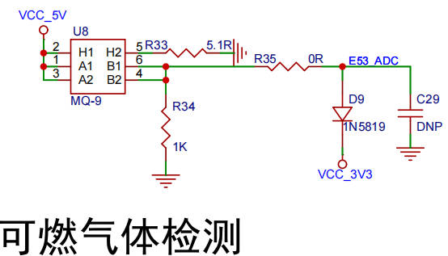
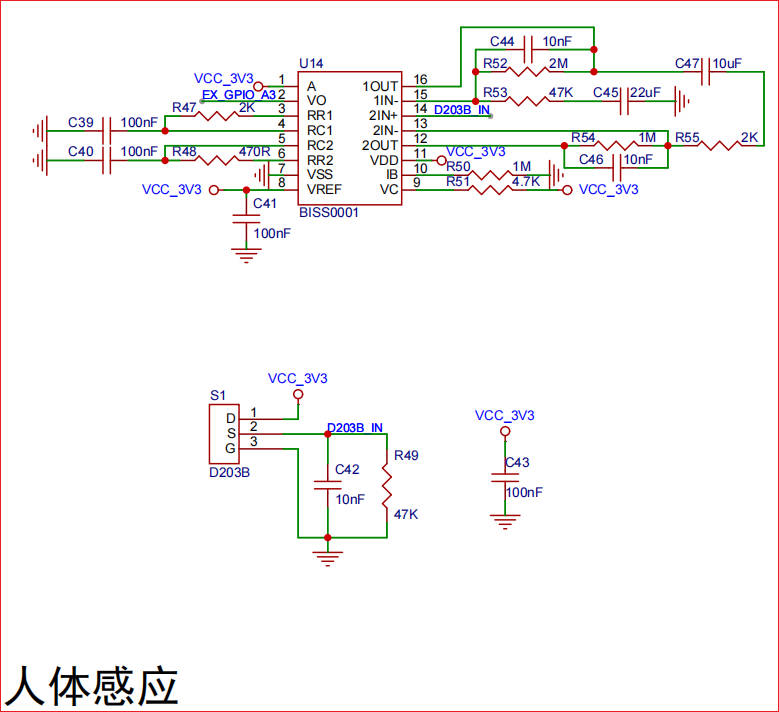
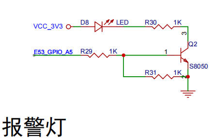
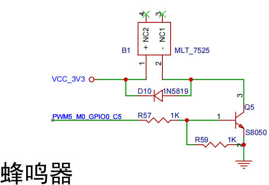
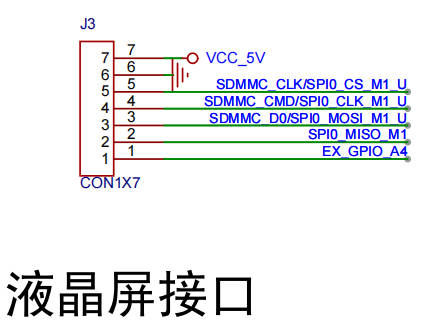
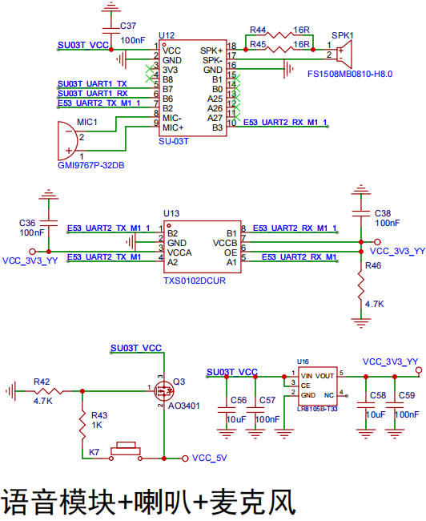
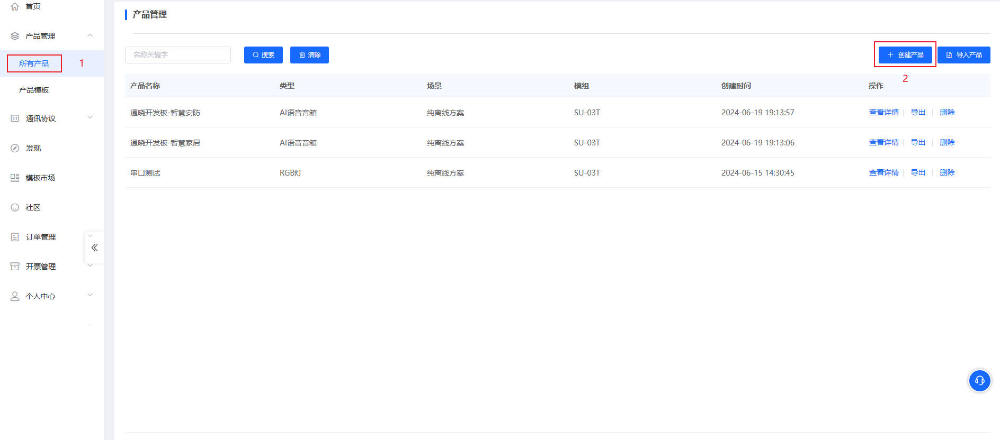
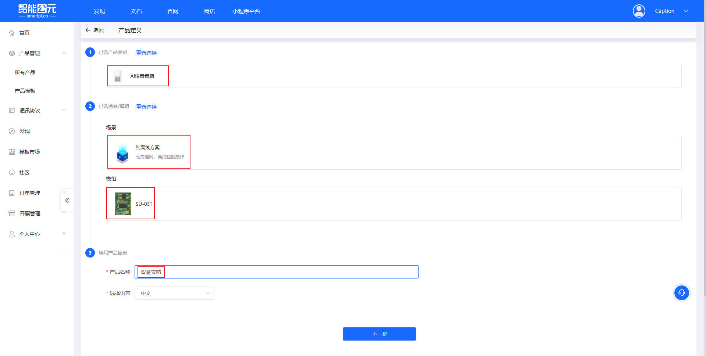
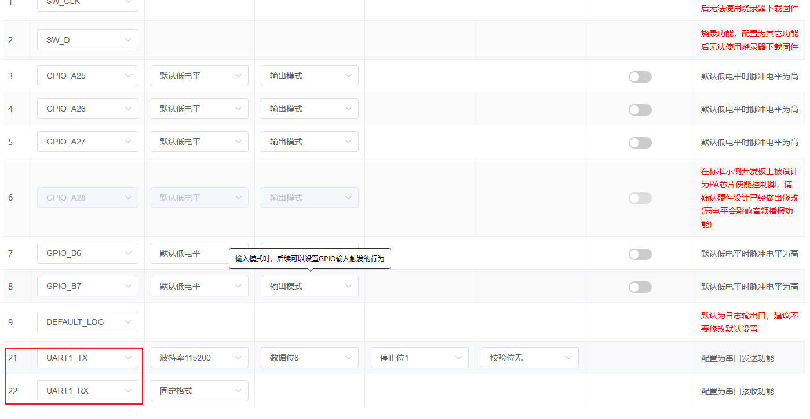
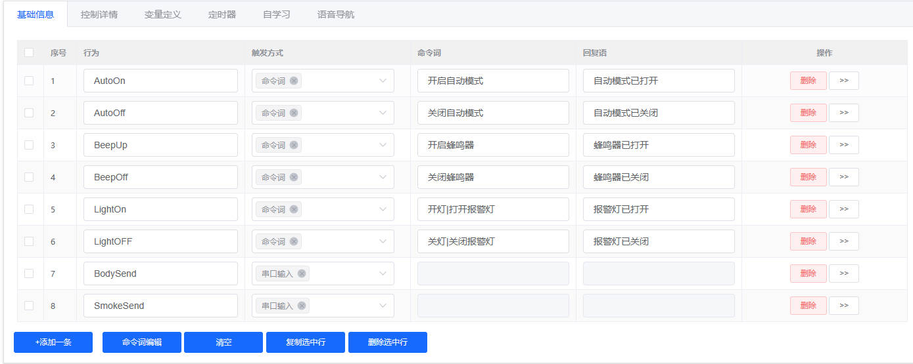

# 通晓开发板综合实验开发——智慧安防

本例程演示如何在通晓开发板上实现智慧安防应用案例。

## 实验设计

使用mq2烟感传感器、人体红外传感器获取烟雾浓度、人体感应信息，根据采集到的数据进行判断控制蜂鸣器、警报灯；LCD屏幕进行信息显示。语音模块获取数据进行播报和控制设备。

### 硬件设计













- mq2烟感传感器使用ADC通道4(GPIO0_PC4)
- lcd屏幕使用SPI0
- 语音模块使用串口2(GPIO0_B2\GPIO0_B3)
- 人体感应使用GPIO控制(GPIO0_PA3)
- 警报灯使用GPIO控制(GPIO0_PA5)
- 蜂鸣器使用PWM5控制(GPIO0_PC5)

### 软件设计

#### 设备初始化

创建两个队列，用于传感器数据分别传输到不同的队列。创建了两个线程，一个用于读数据，一个用于显示与判断设备控制。

```c
void smart_security_example()
{
    unsigned int thread_id_1;
    unsigned int thread_id_2;
    TSK_INIT_PARAM_S task_1 = {0};
    TSK_INIT_PARAM_S task_2 = {0};
    unsigned int ret = LOS_OK;

    ret = LOS_QueueCreate("queue", MSG_QUEUE_LENGTH, &m_msg_queue, 0, BUFFER_LEN);
    if (ret != LOS_OK)
    {
        printf("Falied to create Message Queue ret:0x%x\n", ret);
        return;
    }

    ret = LOS_QueueCreate("su03_queue", MSG_QUEUE_LENGTH, &m_su03_msg_queue, 0, BUFFER_LEN);
    if (ret != LOS_OK)
    {
        printf("Falied to create Message Queue ret:0x%x\n", ret);
        return;
    }

    task_1.pfnTaskEntry = (TSK_ENTRY_FUNC)smart_security_thread;
    task_1.uwStackSize = 2048;
    task_1.pcName = "smart security thread";
    task_1.usTaskPrio = 24;
    ret = LOS_TaskCreate(&thread_id_1, &task_1);
    if (ret != LOS_OK)
    {
        printf("Falied to create task ret:0x%x\n", ret);
        return;
    }

    task_2.pfnTaskEntry = (TSK_ENTRY_FUNC)device_read_thraed;
    task_2.uwStackSize = 2048;
    task_2.pcName = "device read thraed";
    task_2.usTaskPrio = 24;
    ret = LOS_TaskCreate(&thread_id_2, &task_2);
    if (ret != LOS_OK)
    {
        printf("Falied to create task ret:0x%x\n", ret);
        return;
    }
}
```

#### smart_security_thread线程

在`smart_security_thread`线程中初始化lcd、蜂鸣器、警报灯、语音模块设备。通过接收队列传输的数据进行判断显示。

```c
void smart_security_thread(void *arg)
{
    double *data_ptr = NULL;

    double ppm_range = 800.0;

    bool light_last_state = false;
    bool beep_last_state = false;

    beep_dev_init();
    alarm_light_init();
    lcd_dev_init();
    lcd_load_ui();
    su03t_init();

    while(1)
    {
        LOS_QueueRead(m_msg_queue, (void *)&data_ptr, BUFFER_LEN, LOS_WAIT_FOREVER);

        if ((data_ptr[0] > ppm_range || (bool)data_ptr[1]) && auto_state)
        {
            alarm_light_state = true;
            beep_state = true;
            beep_set_state(true);
            alarm_light_set_gpio(true);

            if (beep_state == beep_last_state)
            {
                continue;
            }

            if (alarm_light_state == light_last_state)
            {
                continue;
            }

            if (data_ptr[0] > ppm_range)
            {
                su03t_send_u8_msg(2, 0);
            }
            else if ((bool)data_ptr[1])
            {
                su03t_send_u8_msg(1, 0);
            }

            light_last_state = alarm_light_state;
            beep_last_state = beep_state;
        }
        else if ((data_ptr[0] < ppm_range || !(bool)data_ptr[1]) && auto_state)
        {
            alarm_light_state = false;
            beep_state = false;
            beep_set_state(false);
            alarm_light_set_gpio(false);
            light_last_state = alarm_light_state;
            beep_last_state = beep_state;
        }
        else if(!auto_state)
        {
            beep_set_state(beep_state);
            alarm_light_set_gpio(alarm_light_state);
        }

        lcd_set_ppm(data_ptr[0]);
        lcd_set_body_induction((bool)data_ptr[1]);
        lcd_set_beep_state(beep_state);
        lcd_set_alarm_light_state(alarm_light_state);
        lcd_set_auto_state(auto_state);

        printf("============= smart security example ==============\n");
        printf("======== data ========\r\n");
        printf("ppm:%5.2f\r\n", data_ptr[0]);
        printf("body_induction:%d\r\n", (bool)data_ptr[1]);
        printf("======== state ========\r\n");
        printf("beep_state:%d\r\n", beep_state);
        printf("alarm_light_state:%d\r\n", alarm_light_state);
        printf("auto_state:%d\r\n", auto_state);

        printf("\r\n");

        LOS_Msleep(500);
    }
}
```

在`su03t_init()`中，新开启了一个新线程`su_03t_thread`用于接收语音模块数据并作出响应的反应。

```c
static void su_03t_thread(void *arg)
{
    IotUartAttribute attr;
    double *data_ptr = NULL;
    unsigned int ret = 0;

    IoTUartDeinit(UART2_HANDLE);
    
    attr.baudRate = 115200;
    attr.dataBits = IOT_UART_DATA_BIT_8;
    attr.pad = IOT_FLOW_CTRL_NONE;
    attr.parity = IOT_UART_PARITY_NONE;
    attr.rxBlock = IOT_UART_BLOCK_STATE_NONE_BLOCK;
    attr.stopBits = IOT_UART_STOP_BIT_1;
    attr.txBlock = IOT_UART_BLOCK_STATE_NONE_BLOCK;
    
    ret = IoTUartInit(UART2_HANDLE, &attr);
    if (ret != IOT_SUCCESS)
    {
        printf("%s, %d: IoTUartInit(%d) failed!\n", __FILE__, __LINE__, ret);
        return;
    }

    while(1)
    {
        uint8_t data[64] = {0};
        uint8_t rec_len = IoTUartRead(UART2_HANDLE, data, sizeof(data));

        LOS_QueueRead(m_su03_msg_queue, (void *)&data_ptr, BUFFER_LEN, LOS_WAIT_FOREVER);

        if (rec_len != 0)
        {
            uint16_t command = data[0] << 8 | data[1];
            if (command == auto_state_on)
            {
                auto_state = true;
            }
            else if (command == auto_state_off)
            {
                auto_state = false;
            }
            else if(command == light_state_on)
            {
                alarm_light_state = true;
            }
            else if(command == light_state_off)
            {
                alarm_light_state = false;
            }
            else if(command == beep_state_on)
            {
                beep_state = true;
            }
            else if(command == beep_state_off)
            {
                beep_state = false;
            }
        }

        LOS_Msleep(500);
    }
}
```

#### device_read_thraed线程

在`device_read_thraed`线程中初始化mq2烟感传感器和人体感应传感器设备，将读取的数据放入队列中传输到`smart_security_thread`与`su_03t_thread`线程中进行数据处理。

```
void device_read_thraed(void *arg)
{
    double read_data[2] = {0};

    mq2_init();
    body_induction_dev_init();

    while(1)
    {
        mq2_read_data(&read_data[0]);
        body_induction_get_state((bool *)&read_data[1]);
        LOS_QueueWrite(m_msg_queue, (void *)&read_data, sizeof(read_data), LOS_WAIT_FOREVER);
        LOS_QueueWrite(m_su03_msg_queue, (void *)&read_data, sizeof(read_data), LOS_WAIT_FOREVER);
        LOS_Msleep(500);
    }
}
```

#### 语音模块

##### 创建语音模块项目

链接:[智能公元/AI产品零代码平台 (smartpi.cn)](https://www.smartpi.cn/#/)



选`AI语音音响`-`纯离线方案`-`SU03-T模块`。



##### 生成语音内容

将21、22引脚修改为`UART1_TX`和`UART1_RX`。



修改唤醒词为`通晓通晓`


配置基础信息。点击`添加一条`-`输入行为`-`选择触发方式`-`输入命令词`-`回复语`

触发方式：

- 命令词触发：说出命令词进行触发，语音模块做出相应回复或发送响应命令。
- 串口输入触发：通过特定的格式输入语音模块的串口。语音模块做出相应回复或发送响应命令。



配置命令词触发。以打开蜂鸣器为例。


输出方式选择`端口输出`；控制类型选择`UART1_TX`；动作选择`发送`；参数`02 01`。

参数每个人都可以自定义自己的参数。


串口输入触发。以获取人体感应传感器为例。

通晓开发板通过回复一定格式的串口数据，用于触发`BodySend`行为。`BodySend`行为触发后进行语音播报。


在通晓开发板端的`su_03t.c`中的`su_03t_thread`线程中接收串口数据。通过不同的命令执行不同的功能。

```c
// smart_home.h
enum auto_command
{
    auto_state_on = 0x0001,
    auto_state_off,
};

enum light_command
{
    light_state_on = 0x0101,
    light_state_off,
};

enum beep_command
{
    beep_state_on = 0x0201,
    beep_state_off,
};

enum senror_command
{
    body_send = 0x0301,
    smoke_send,
};

// su_03t.c
uint8_t data[64] = {0};
uint8_t rec_len = IoTUartRead(UART2_HANDLE, data, sizeof(data));

if (rec_len != 0)
{
    uint16_t command = data[0] << 8 | data[1];
    if (command == auto_state_on)
    {
        auto_state = true;
    }
    else if (command == auto_state_off)
    {
        auto_state = false;
    }
    else if(command == light_state_on)
    {
        alarm_light_state = true;
    }
    else if(command == light_state_off)
    {
        alarm_light_state = false;
    }
    else if(command == beep_state_on)
    {
        beep_state = true;
    }
    else if(command == beep_state_off)
    {
        beep_state = false;
    }
}
```

## 编译调试

### 修改 BUILD.gn 文件

修改 `vendor/isoftstone/rk2206/sample` 路径下 BUILD.gn 文件，指定 `smart_security_example` 参与编译。

```r
"./d2_smart_security:smart_security_example",
```

修改 `device/rockchip/rk2206/sdk_liteos` 路径下 Makefile 文件，添加 `-lsmart_security_example` 参与编译。

```r
hardware_LIBS = -lhal_iothardware -lhardware -lsmart_security_example,
```

### 运行结果

示例代码编译烧录代码后，按下开发板的RESET按键，通过串口助手查看日志，显示如下：

```c
============= smart security example ==============
======== data ========
ppm:20.00
body_induction:0
======== state ========
beep_state:0
alarm_light_state:0
auto_state:1

============= smart security example ==============
======== data ========
ppm:20.00
body_induction:0
======== state ========
beep_state:0
alarm_light_state:0
auto_state:1

============= smart security example ==============
======== data ========
ppm:20.00
body_induction:0
======== state ========
beep_state:0
alarm_light_state:0
auto_state:1
```
